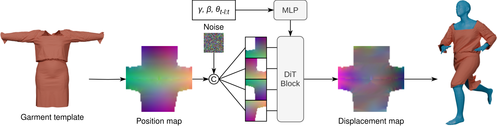

<div align="center">
  <h1>DiT-Garment: Garment Dynamics with Diffusion Transformers</h1>

  <p style="font-size:1.2em">
    <a href="https://dumoulin.me/"><strong>Antoine Dumoulin</strong></a> ·
    <a href="https://www.inrialpes.fr/sed/people/boissieux/"><strong>Laurence Boissieux</strong></a><br>
    <a href="https://joaoregateiro.github.io/"><strong>Joao Regateiro<</strong></a> ·
    <a href="https://people.irisa.fr/Pierre.Hellier/"><strong>Pierre Hellier</strong></a> ·
    <a href="https://swuhrer.gitlabpages.inria.fr/website/"><strong>Stefanie Wuhrer</strong></a>
  </p>

  <p align="center" style="margin: 2em auto;">
    <a href='https://dumoulina.github.io/dit-garment/'></a>
    <a href='https://doi.org/10.48550/arXiv.2609.18510'></a>
    <!-- <a href=''></a> -->
  </p>

</div>



# Installation

(Instructions coming soon)

# Reproducibility

(Code coming soon)

# Citation
```
@misc{dumoulin2026ditgarment,
  title={DiT-Garment: Garment Dynamics with Diffusion Transformers}, 
  author={Antoine Dumoulin and Laurence Boissieux and Joao Regateiro and Pierre Hellier and Stefanie Wuhrer},
  journal={arXiv preprint arXiv:2609.18510},
  year={2026},
  url={https://doi.org/10.48550/arXiv.2609.18510}, 
}
```

License

This code is subject to a non-commerical [license](LICENSE.pdf).